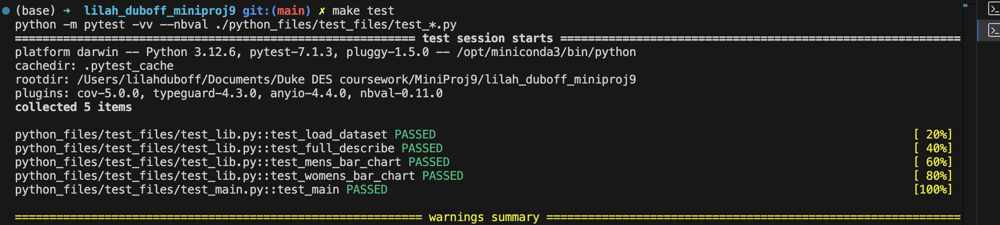

# Mini-Project 9: Cloud-Hosted Notebook Data Manipulation
---
##### The purpose of this project is to build a cloud-hosted notebook using Google Colab, generate a simple data exploration and analysis using a dataset, and return a project in a GitHub repo that contains a CI/CD pipeline and functioning tests. In this project, we will be exploring and analyzing a free Kaggle dataset the contains information about the average hourly wages for different levels of education, over a span of 50 years (1973-2022). The data is then further broken down by sex and race, allowing for demographics comparison of average pay by education level. The analyses provided compare the average hourly wage based on education level, for 2022 and 1973 (the limits of the dataset), and continue to show the differences in average hourly wages between all men and women who have earned a bachelors or advanced degree.
---
### Requirements
- [x] Set up a cloud-hosted Jupyter Notebook (e.g., Google Colab)
- [x] Perform data manipulation tasks on a sample dataset
- [x] Setup and configuration (20 points)
- [x] Data manipulation tasks (20 points)
- [x] CI/CD pipeline (10 points)
- [x] Link to the cloud-hosted notebook
- [x] Document or video demonstrating the tasks performed

---
### File Structure
---
### Data Cleaning and Exploration
---
### Data Analysis
---
### Conclusions about the Analysis and Recommendations